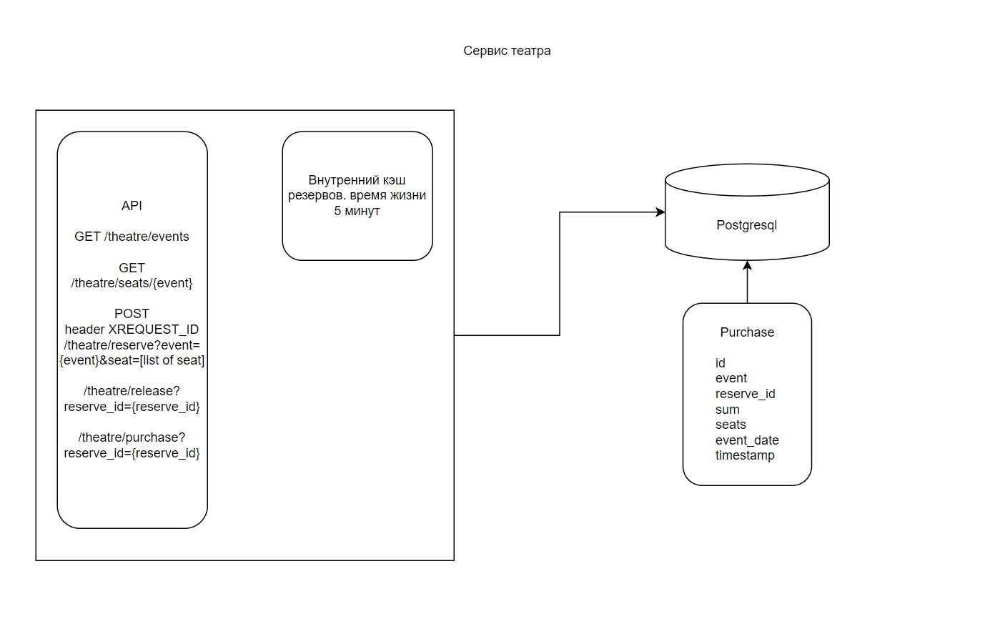

# Сервис "Театр"

## Описание
Сервис театр - часть инфраструктуры нагрузочного стенда. Можно использовать для нагрузки, как отдельно, так и вместе с остальным контуром.

## Бизнес-ценность
Загружается с некоторым списком эвентов [Event.java](src/main/java/ru/nspk/performance/theatre/model/Event.java) и позволяет резервировать места [Seat.java](src/main/java/ru/nspk/performance/theatre/model/Seat.java) на них.

## API
Апи представляет из себя 5 входных точек, развернутых внутри пространства uri /theatre

### GET /events
Список доступных для резерва и покупки эвентов
Возвращает:
- events {
    name - наименование эвента.
    date - день начала эвента.
}
- список эвентов

- errorMessage - в случае ошибки, добавляется сообщение, описывающее проблему

### GET /seat/{event}
Список доступных для резерва мест. **event** - наименование эвента

- eventName
- errorMessage - в случае ошибки, добавляется сообщение, описывающее проблему 
- seats {
    place - координата места, например 2A или 5E
    seatStatus - статус, см [SeatStatus.java](src/main/java/ru/nspk/performance/theatre/model/SeatStatus.java)
    price - стоимость конкретного места в рублях (double)
} - список доступных мест

### POST /reserve
Резервация. В качестве request params указывается event - наименование эвента и seat - список мест (List<String>). 
В качестве хедера должен быть передан XREQUEST_ID - реквест айди для синхронизации запросов. 
Возвращает объект в формате JSON:
- reserveId - id резерва
- requestId - реквест айди из header
- reserveStarted - время с которого начинается резервация
- nonFreeSeats - в случае, если резерв не неуспешен, то указывается список сидений, для которых не доступен резерв.
- reserveDuration - максимальное время в течении которого доступна оплата [purchase]
- errorMessage - в случае ошибки, добавляется сообщение, описывающее проблему

### POST /release
Отмена резерва. В качестве request params указывается reserve_id - id резерва.
- message - информационное сообщение
- reserveId - id резерва
- errorMessage - в случае ошибки, добавляется сообщение, описывающее проблему

### POST /purchase 
Подтверждение покупки. В качестве request params указывается reserve_id - id резерва.

## Архитектурная схема

## Сущности

### Purchase

| Наименование колонки | Описание                                     | Уникальное | Тип          |
|----------------------|----------------------------------------------|------------|--------------|
| id                   | primary key. Автоинкрементый идентификатор.  | Да         | bigint       |
| event                | Наименование эвента.                         | Нет        | varchar(250) |
| reserve_id           | Идентификатор резерва. Индексированное поле. | Нет        | bigint       |
| sum                  | Итоговая сумма резерва                       | Нет        | double       |
| seats                | Список сидений                               | Нет        | jsonb        |
| event_date           | дата эвента                                  | Нет        | date         |
| timestamp            | Время создание покупки                       | Нет        | timestamp    |

## Настройки
Перечислены только важные и кастомные настройки.

| Наименование            | Полный путь           | Описание                                               | Значение по умолчанию                     |
|-------------------------|-----------------------|--------------------------------------------------------|-------------------------------------------|
| Таймаут кэша            | cache.timeout         | Время жизни сообщений в кэше                           | PT5M                                      |
| Путь к файлу с эвентами | events.path           | Все эвенты на данный момент загружаются из этого файла | Theatre/Events.json                       |
| Путь к postgresql       | spring.datasource.url | Путь к БД постргресса                                  | jdbc:postgresql://localhost:5435/postgres |

